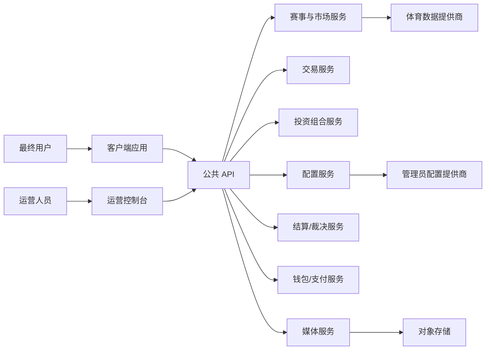

---
标题：架构概述
版本：0.1
最后更新：2025-12-14
所有者：产品与工程部
状态：草稿
---

# 架构概述

## 1. 系统目标
- 使用户能够发现体育赛事并参与预测市场。
- 提供透明的市场信息（选项、隐含概率、流动性、趋势）。
- 支持以博彩公司模式创建市场，具有可配置的投注类型和验证。
- 提供投资组合可见性（持仓、潜在利润）和负责任交易提示。

## 2. 高层模块
- **赛事发现**：特色市场、类别筛选、排序、市场卡片。
- **市场详情**：市场标题、选项列表、市场趋势、规则/裁决视图。
- **交易与投注**：报价、验证、提交投注、状态反馈、限制。
- **投资组合与持仓**：持仓摘要、持仓列表、对冲提示。
- **市场创建（博彩公司）**：配置赛事 + 投注 + 流动性 + 截止时间，确认，创建。
- **运营与配置**：特色/置顶控制、配置分发（投注类型、图片）。
- **状态与结算可见性**：状态模型和用户可见的结算/裁决工件。

## 3. 系统上下文（摘要）
详情请参阅 [系统上下文](system-context.md)。

## 4. 组件交互（逻辑）

## 5. 关键架构原则
- **技术无关的契约**：API 和数据模型定义行为和架构，而非实现。
- **清晰的状态所有权**：市场状态转换在服务器端具有权威性；客户端反映状态。
- **幂等的金融操作**：投注提交和钱包扣款要求幂等性和可审计性。
- **配置驱动的产品**：特色/置顶市场、投注类型和 UI 选项由配置驱动。
- **优雅降级**：部分中断（体育数据、媒体、钱包）有定义好的备用用户体验和错误处理。