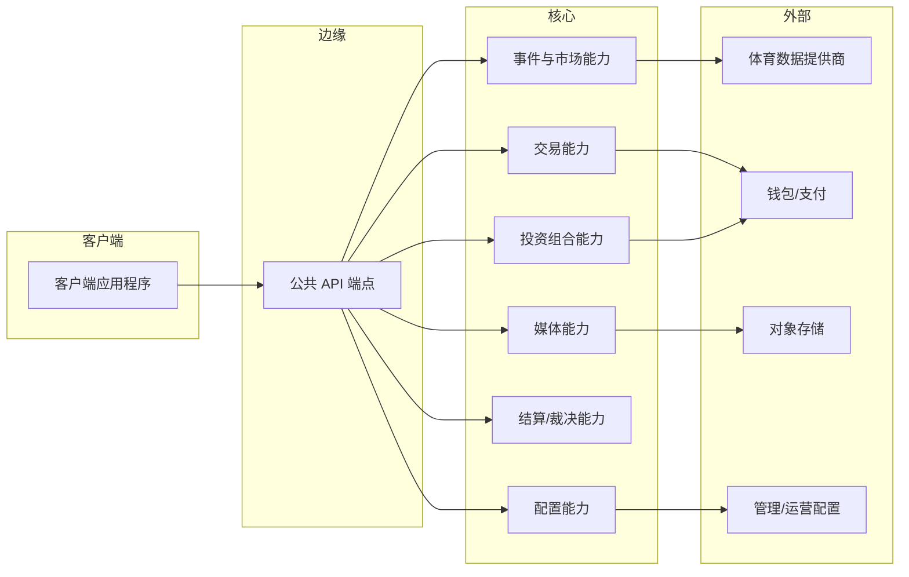

---
标题：部署视图
版本：0.1
最后更新：2025-12-14
所有者：产品与工程部
状态：草稿
---

# 部署视图

## 1. 部署假设（与技术无关）
- 用户通过**客户端应用程序**（Web和/或移动端）访问系统。
- 客户端通过 HTTPS 与**公共 API** 通信。
- 核心功能可以实现为独立服务或模块化单体应用；接口契约保持稳定。

## 2. 部署图（逻辑）

## 3. 可用性预期（高层次）
- API 在体育赛事高峰期间应保持可用；错误处理必须能优雅降级。
- 状态变更操作（下注、创建市场）需要比只读端点更强的保证。