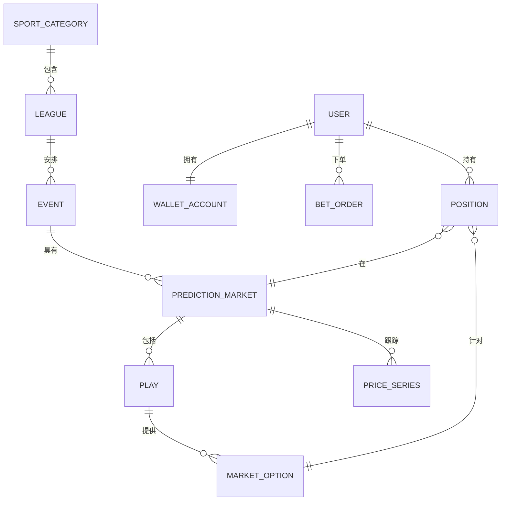

---
标题：数据模型概述
版本：0.1
最后更新：2025-12-14
所有者：产品与工程部
状态：草稿
---

# 数据模型概述

## 1. 目的
定义所有模块和 API 引用到的共享实体、关系、枚举和模式片段。

## 2. 建模约定
- ID：`string`（可以是 UUID 或不透明字符串）
- 货币金额：`{ "amount": decimal, "currency": "ISO-4217" }`
- 时间戳：ISO 8601 UTC 字符串
- 百分比值：
  - `sharePct`：百分比 0–100
  - `impliedProbability`：小数 0–1

## 3. 关系摘要

## 4. 文档链接
- 实体：[实体](entities.md)
- 枚举：[枚举](enumerations.md)
- JSON 模式：[JSON 模式](json-schemas.md)