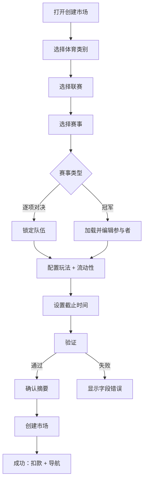

# 1. 模块概述

## 模块名称和标识符
- 名称：市场创建（庄家模式）
- 标识符：MOD-MARKET-CREATION

## 目的
使创建者（庄家）能够通过选择体育项目/联赛/赛事、配置玩法类型和选项、设置初始流动性和定义截止时间，来创建一个新的预测市场，并提供强大的验证和确认机制。

## 范围
- 范围内：市场创建入口点、全屏模态流程、赛事选择、队伍配置、封面选择/上传、玩法配置（趣味/大小/让分/准确比分）、核心玩法的初始流动性、截止时间、总流动性计算、提交验证、确认步骤、成功行为。
- 范围外：用于管理配置的运营后台工具（参见 `modules/07-operations-and-configuration.md`）。

## 模块边界
从用户打开“创建市场”开始，到市场成功创建（或流程取消）结束。

## 依赖项
- 用于类别/联赛/赛事/队伍的体育数据（[体育数据](../integrations/sports-data.md)）
- 用于可用玩法类型和趣味玩法的配置服务（[运营与配置](07-operations-and-configuration.md)）
- 用于封面预设和上传的媒体存储（[媒体存储](../integrations/media-storage.md)）
- 用于初始流动性资助的钱包余额和扣款（[钱包与支付](../integrations/wallet-and-payments.md)）
- 创建市场 API（[市场创建 API](../api-specifications/market-creation.md)）

## 利益相关者
- 庄家（创建者）、最终用户（消费者）、运营、风控/合规

# 2. 功能需求

## 需求列表
- FR-MC-001：系统应从体育主页和用户个人中心/中心暴露“创建市场”入口点。
- FR-MC-002：创建流程应以全屏模态框的形式呈现。
- FR-MC-003：流程应包含以下部分：体育类别、联赛选择、赛事选择、队伍/参与者配置、封面选择、玩法配置、资金设置、截止时间、提交和确认。
- FR-MC-004：体育类别选择应默认为“足球”（或第一个已配置的类别），更改类别将重置依赖字段（联赛、赛事、队伍、玩法配置）。
- FR-MC-005：联赛选项应根据所选体育项目动态加载。
- FR-MC-006：赛事选项应根据所选联赛动态加载，并在适用时包含特殊的“冠军”赛事类型。
- FR-MC-007：系统应确定赛事类型：
  - 逐项对决赛事：显示固定的“队伍 1/队伍 2”部分，从赛事元数据填充且不可编辑。
  - 冠军赛事：显示可编辑的参与者列表，默认预加载 10 个参与者。
- FR-MC-008：系统应允许从预设库中选择封面图片，并允许上传自定义图片（需符合约束条件）。
- FR-MC-009：系统应允许配置具有时间段选择器的玩法：全场、上半场、下半场；冠军赛事禁用时间段选择器。
- FR-MC-010：系统应支持玩法标签页：
  - 趣味玩法（由配置驱动）
  - 大小盘 (Over/Under)
  - 让分盘 (Spread)
  - 准确比分 (Correct score)
- FR-MC-011：趣味玩法的定义和选项集应从服务器配置加载。
- FR-MC-012：冠军赛事强制趣味玩法为“冠军”，并显示参与者选项；创建者可以选择一个参与者作为庄家的估计值。
- FR-MC-013：大小盘配置应：
  - 使用可调整步长为 0.5 的基准值
  - 支持范围 0.5–999.5
  - 不允许整数
- FR-MC-014：让分盘配置应：
  - 使用可调整步长为 0.5 的让分值
  - 支持范围 0.5–99.5
  - 不允许整数
  - 显示主队为正让分，客队为负让分
- FR-MC-015：准确比分配置应：
  - 仅在全场时可用
  - 支持 2–32 个唯一比分选项
  - 将每队比分限制在整数 0–99 范围内
- FR-MC-016：所选核心玩法必须包括一个初始流动性金额。
- FR-MC-017：每种玩法的初始流动性必须满足：
  - 每种玩法的最低限额：1000（假设；参见 BR-MC-006）
  - 不得超过可用余额
- FR-MC-018：系统应计算并显示总流动性，即所有已配置玩法的初始流动性金额之和。
- FR-MC-019：系统应提供一个截止时间选择器，默认设置为赛事开始时间减去 15 分钟。
- FR-MC-020：截止时间验证必须确保截止时间在当前时间之后且在赛事开始时间之前。
- FR-MC-021：系统应验证必填字段，并在提交前显示特定于字段的错误。
- FR-MC-022：系统应显示一个总结关键配置的确认步骤，并允许返回编辑。
- FR-MC-023：成功后，系统应：
  - 显示成功消息
  - 从创建者余额中扣除总流动性
  - 关闭模态框
  - 导航到新创建的市场详情页
  - 确保市场出现在发现列表中
- FR-MC-024（MVP）：系统必须限制每个市场只允许**一个**核心玩法配置；不支持在同一市场下同时创建多个玩法组合。

## 用户故事
- 作为一个创建者，我希望配置不同的玩法类型并注入流动性，以便用户可以在我的市场中进行交易。
- 作为一个创建者，我希望拥有强大的验证和一个确认步骤，以避免意外的错误配置。

## 用例
### UC-MC-001：创建一个逐项对决市场
- 参与者：庄家（创建者）
- 前置条件：创建者已通过身份验证且余额充足
- 主要流程：
  1. 创建者打开“创建市场”。
  2. 选择体育类别 → 选择联赛 → 选择赛事（逐项对决）。
  3. 队伍自动填充并锁定。
  4. 选择封面（预设或上传）。
  5. 配置至少一个玩法并设置初始流动性。
  6. 设置截止时间。
  7. 提交 → 确认 → 创建。
  8. 系统扣除总流动性并导航到详情页。

### UC-MC-002：创建一个冠军市场
- 参与者：庄家（创建者）
- 前置条件：存在冠军赛事选项
- 主要流程差异：
  - 参与者列表预加载且可编辑；时间段选择器禁用；趣味玩法固定为“冠军”。

## 业务规则
- BR-MC-001：此版本仅支持庄家模式。
- BR-MC-002：更改体育类别会重置联赛/赛事/队伍/玩法配置。
- BR-MC-003：准确比分仅在全场时可用。
- BR-MC-004：基准值（大小盘）和让分值（让分盘）必须是非整数（步长为 0.5）。
- BR-MC-005：准确比分选项在 (主队比分, 客队比分) 组合中必须是唯一的。
- BR-MC-006：每种玩法的最低初始流动性在此 SRD 中视为 1000；PRD 中的一条验证消息存在冲突值，产品团队需确认最终政策。
- BR-MC-007（MVP）：`plays` 数组仅允许 1 个元素；多玩法组合属于未来能力。

## 验证规则
- VR-MC-001：必填字段：体育类别、联赛、赛事、至少一个已配置的玩法、截止时间。
- VR-MC-002：提交时，总流动性必须 ≤ 可用余额。
- VR-MC-003：上传约束：JPG/PNG；最大 2MB；推荐 800×450（除非策略要求硬性执行，否则仅作为警告）。

# 3. API 规范（技术无关）
参见 [市场创建 API](../api-specifications/market-creation.md)。

## 端点定义（摘要）
- `GET /api/sports`
- `GET /api/leagues?sportId={sportId}`
- `GET /api/events?leagueId={leagueId}`
- `GET /api/config/play-types?sportId={sportId}`
- `GET /api/config/fun-plays?sportId={sportId}`
- `GET /api/media/presets?type=market-cover`
- `POST /api/media/uploads`
- `POST /api/markets`

## 身份验证/授权
- 所有市场创建端点都需要经过身份验证的用户。
- 授权必须确保用户只能以其自己的身份和资金来源创建市场。

## 错误处理
- 使用 [通用错误](../api-specifications/common-errors.md) 中的标准错误封装。

# 4. 数据模型和模式
参见 [实体](../data-models/entities.md) 和 [JSON 模式](../data-models/json-schemas.md) 中关于 `MarketCreateRequest`、玩法配置和验证约束的内容。

# 5. 业务逻辑需求

- BL-MC-001：总流动性计算为所有已配置玩法的初始流动性之和。
- BL-MC-002：默认截止时间为 `赛事开始时间 - 15 分钟`。
- BL-MC-003：服务器必须在提交时重新验证余额充足性和截止时间约束。

# 6. 集成点
- 体育数据：联赛/赛事/队伍和开始时间。
- 钱包：余额检查和总流动性扣款。
- 媒体：预设库和上传存储。
- 配置：每种体育项目的玩法可用性和趣味玩法定义。

# 7. 非功能性需求
- NFR-MC-001：从创建者的角度来看，提交必须是原子的：要么市场被创建且资金被预留/扣除，要么两者都不发生。
- NFR-MC-002：在提交期间，流程必须提供全屏加载遮罩，以防止重复操作。
- NFR-MC-003：验证错误必须是明确的，并映射到相应的字段。

# 8. 验收标准
- AC-MC-001：切换体育类别会重置联赛/赛事和玩法配置。
- AC-MC-002：准确比分玩法不能在上半场/下半场进行配置。
- AC-MC-003：在提交前拒绝重复的准确比分条目。
- AC-MC-004：截止时间晚于赛事开始时间或早于当前时间将被拒绝，并显示清晰的消息。
- AC-MC-005：成功创建后，用户将被导航到新市场，并且该市场出现在发现列表中。
- AC-MC-006（MVP）：当创建者尝试配置多于一个玩法时，系统必须阻止提交并显示清晰的提示（或不提供添加第二个玩法的入口）。
