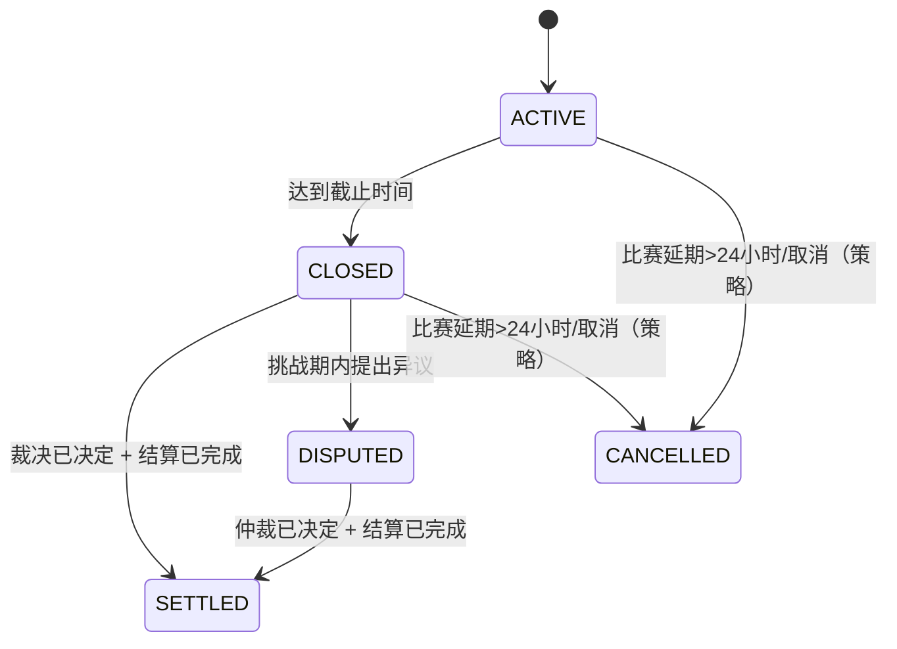

---
标题：模块规范 — 市场状态与结算可见性
版本：0.1
最后更新：2025-12-14
所有者：产品与工程
状态：草稿
---

# 1. 模块概述

## 模块名称和标识符
- 名称：市场状态与结算可见性
- 标识符：MOD-MARKET-STATES

## 目的
定义市场生命周期状态以及与每个状态相关的用户可见行为和限制，包括结算和裁决的可见性。

## 范围
- 范围内：状态定义、UI 标签、用户操作限制、结算/裁决展示要求。
- 范围外：内部裁决决策流程（所有权可能在外部）；此模块定义可见性和接口要求。

## 模块边界
当市场状态影响显示或允许的操作时，适用于所有模块。

## 依赖项
- 市场状态权威（服务器端）
- 裁决和结算数据源（[市场 API](../api-specifications/markets.md)）

## 利益相关者
- 最终用户、运营、风险/合规、产品、工程

# 2. 功能要求

## 要求列表
- FR-MS-001：系统应至少表示以下市场状态：ACTIVE（进行中）、CLOSED（已结束）、SETTLED（已结算）、DISPUTED（有争议）、CANCELLED（已取消）。
- FR-MS-002：客户端应显示以下状态标签：
  - ACTIVE → “进行中”
  - CLOSED → “已结束”
  - SETTLED → “已结算”
  - DISPUTED → “有争议”
  - CANCELLED → “已取消”
- FR-MS-003：在 ACTIVE 状态下，用户可以查看和下注，但需遵守交易限制。
- FR-MS-004：在 CLOSED 状态下，用户可以查看但不得下新注。
- FR-MS-005：在 SETTLED 状态下，用户可以查看结果和结算结果，但不得下新注。
- FR-MS-006：系统应显示并暴露截止时间和结算时间（如果可用）。
- FR-MS-007：裁决选项卡应反映裁决状态（挑战期中/有争议/已决定）以及外部依赖（预言机、仲裁方）和关键时间点（提交时间、挑战期结束时间、决定时间），并展示宣布的获胜选项（如已决定）。
- FR-MS-008：结算完成后，系统应在持仓中（如适用）和市场级别结算摘要中显示用户支付结果。
 - FR-MS-009：当市场处于 CANCELLED 状态时，系统必须显示取消原因摘要（如果可用）并说明退款处理（如适用）。

## 用户故事
- 作为一个最终用户，我希望知道市场是否仍然可以交易，以便我在截止时间后不会尝试下注。
- 作为一个最终用户，我希望看到最终结果和结算情况，以便我可以验证我的支付。

## 用例
### UC-MS-001：市场在截止时间关闭
- 参与者：系统、最终用户
- 前置条件：市场处于 ACTIVE 状态
- 主要流程：
  1. 到达截止时间。
  2. 服务器将市场转换到 CLOSED 状态。
  3. 客户端反映状态标签并禁用投注操作。

### UC-MS-002：市场在裁决后结算
- 参与者：结算/裁决提供方、系统、最终用户
- 前置条件：市场处于 CLOSED 状态；裁决决定可用
- 主要流程：
  1. 裁决宣布获胜选项。
  2. 结算完成支付并使市场转换到 SETTLED 状态。
  3. 客户端显示最终状态和结果。

## 业务规则
- BR-MS-001：服务器是状态的最终信息源；如果服务器显示非活动状态，客户端不得允许投注。
- BR-MS-002：在正常操作中，状态转换必须是单调的：ACTIVE → CLOSED → SETTLED。
- BR-MS-003：当发生争议时，系统可进入 DISPUTED 状态；在 DISPUTED 状态下，市场必须为只读，直到裁决确定。
- BR-MS-004：如果比赛延期超过 24 小时，市场可以被取消并退款；若取消，市场状态为 CANCELLED，并且不得再允许下注。
- BR-MS-005：挑战期长度必须可配置（本版本默认 2 小时），并在“裁决”页签对用户可见（参见 `integrations/oracle-and-dispute-resolution.md`）。

## 验证规则
- VR-MS-001：当市场状态不是 ACTIVE 时，所有下注请求必须被服务器拒绝。

# 3. API 规范（技术无关）
参见 [市场 API](../api-specifications/markets.md)。

## 端点定义（摘要）
- `GET /api/markets/{marketId}`
- `GET /api/markets/{marketId}/adjudication`
- `GET /api/markets/{marketId}/settlement`

# 4. 数据模型和模式
有关 `MarketState` 和结算实体，请参见 [实体](../data-models/entities.md) 和 [枚举](../data-models/enumerations.md)。

# 5. 业务逻辑要求

- BL-MS-001：系统必须处理时钟差异；客户端计时器仅供参考，必须根据服务器响应进行更正。

# 6. 集成点
- 裁决/结算提供方（内部或外部）提供决定和结算结果。
- 预言机与争议解决（UMA / Kleros）：参见 [预言机与争议解决](../integrations/oracle-and-dispute-resolution.md)。

# 7. 非功能性要求
- NFR-MS-001：结算可见性必须一致且防篡改；用户支付摘要必须源自权威结算记录。
- NFR-MS-002：状态更改必须快速传播到客户端（轮询或推送机制是实现选择）。

# 8. 验收标准
- AC-MS-001：在 CLOSED 或 SETTLED 状态下，投注按钮禁用，尝试投注会导致明确的错误提示。
- AC-MS-002：裁决选项卡在可用时显示待定与已决定状态以及获胜选项。
- AC-MS-003：未知状态显示只读警告并禁用交易操作。
- AC-MS-004：在 DISPUTED 状态下，状态标签为“有争议”，并且所有下注入口点禁用。
- AC-MS-005：在 CANCELLED 状态下，状态标签为“已取消”，并显示取消/退款提示信息（如可用）。
